# US20190179766 translation_table_prefetch

使用硬件实现翻译表（translation table, TT），缩短取指令延迟。

翻译表表项存储源代码和目标代码之间的映射，一种实现方式是存储源码和目标码的内存地址。受限于空间大小，TT可能只存储地址映射的子集，完整的集合被存放在更大但更远的存储设备。（类似于TLB）

处理器通过TT中的地址映射找到翻译后的代码。

翻译表控制逻辑：拿到一个将要执行的（处于PC级）指令的内存地址，查看TT中是否包含这个内存地址。如果有（hit）:执行单元执行找到的代码；如果没有（miss）：执行原来的代码或者到全集中找并加入TT。

TT的替换策略通常和cache一样，常用LRU。

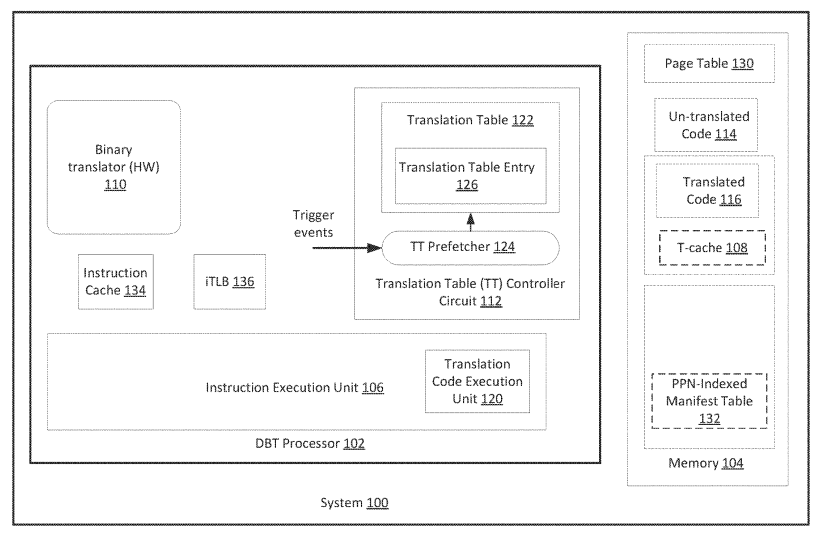

可以将100看成SoC，106可以包含一个untranslated Unit执行未翻译的代码和一个translated Unit执行翻译后的代码。110可以是硬件电路或者执行在102上的软件，在这篇专利中用来做动态二进制翻译。112用PC中对应的地址查找TT，找到则执行翻译后的代码，否则执行未翻译的。

一种可能的情况：热点代码的优化。untranslated code执行在106中untranslated Unit，性能分析器等硬件逻辑分析器发现有超过设定阈值的代码段，唤醒110,110找到代码段进行翻译放入108T-cache并将地址对应存入TT中。在优化中可以对一段代码进行若干轮的优化，相应的优化次数越多，优化程度越高，所需翻译时间也越多，处理器可以控制在不同的阶段对代码进行进一步优化，122中存储gear level表示优化的程度，存储代码段执行次数。124预取器在执行期间遇到触发事件到主存104中132取可能会用到的下一个地址映射到122中。

124接收到触发事件进行预取，触发事件可能是iTLB的miss。

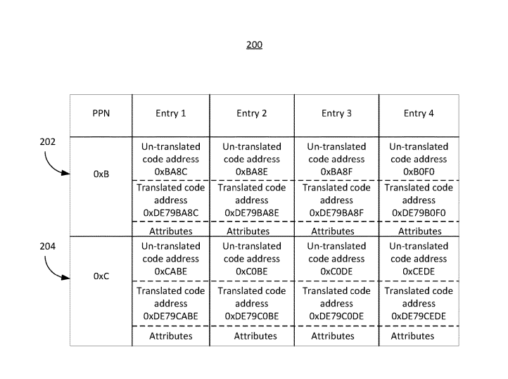

上图是图1中132manifest table的结构，使用PNN进行映射的一部分索引，从而减少硬件电路大小和访问延迟。attributes中存表示代码块重要性的数值，例如包含循环的代码块因为可能优化空间大比不包含循环的重要，attributes存储与122中相对应的数值，如果超过提前设定的阈值，可能会被放入122.

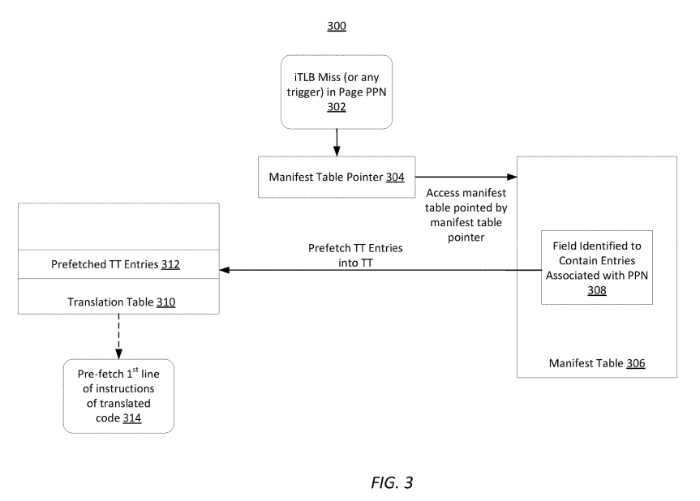

iTLB miss会触发TT预取，使用物理页号（PPN）索引找到manifest table中数据对象，放到TT中。进一步可能会预取translated code到icahce中。

其他触发预取事件：例如跨页

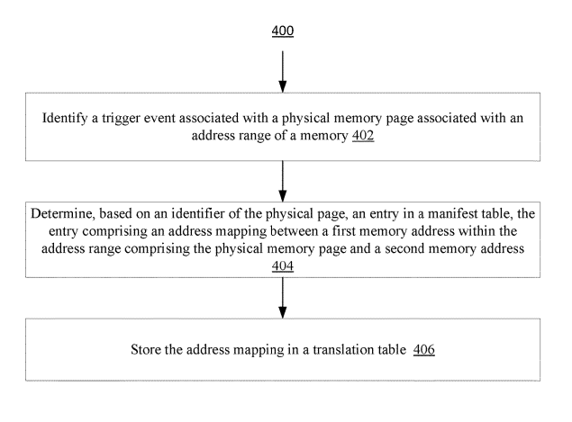

三步，触发事件出发预取，到manifest table查找，填TT。

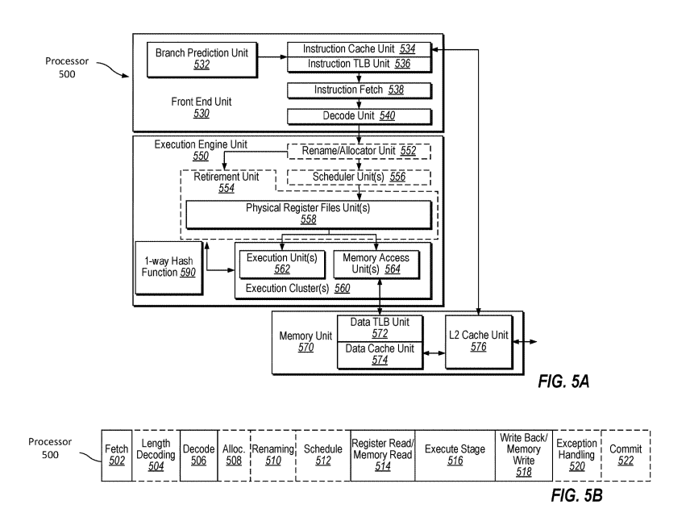

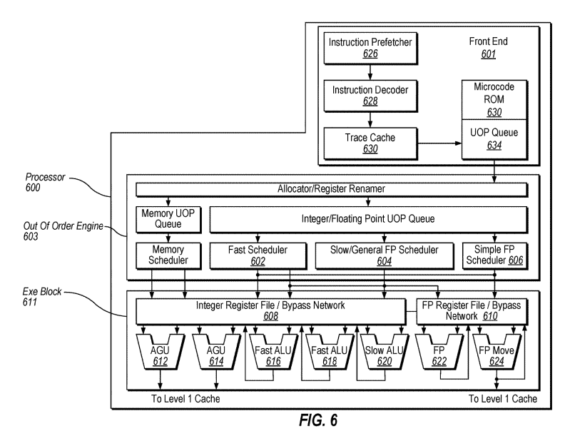

decoder628有两种：

1. 将指令转换成为一条或多条微码，然后执行

2. 将指令解析成为opcode、数据等。

trace cache630将译码后的微码uop按照程序序放入uop queue，当trace cache遇到复杂的指令，microcode RPM直接提供完整的操作。

图5图6对应的专利中讲了很多处理器实现的细节。和本专利好像没什么关系，但是对于处理器设计细节还是值得一看的。

以下是一些不同的处理器应用，专利中也有介绍。

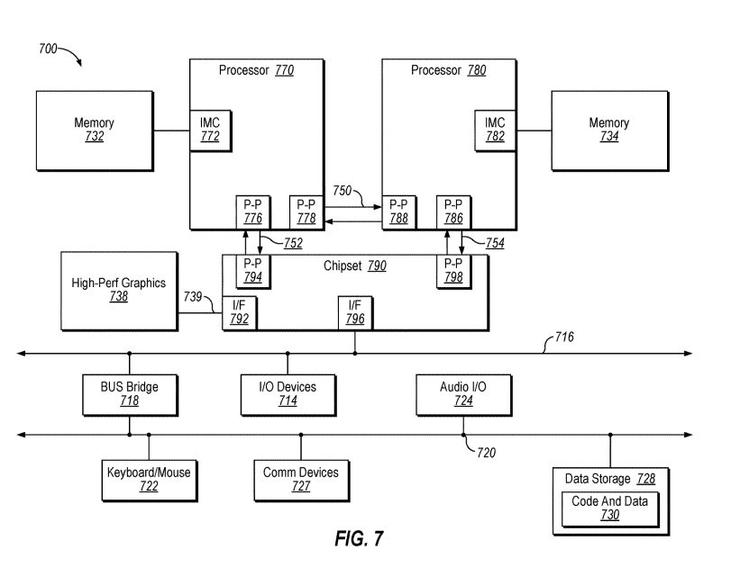

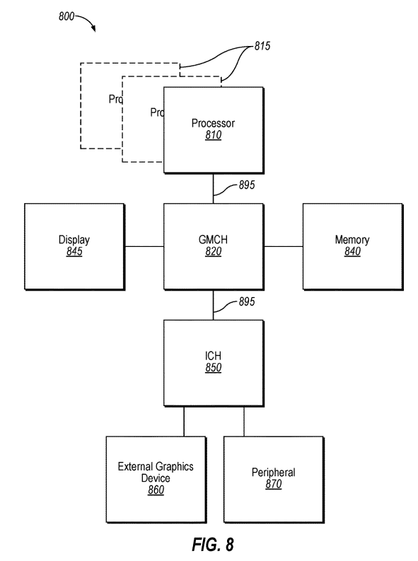

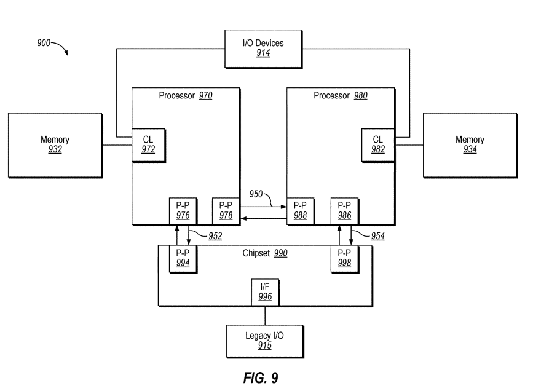

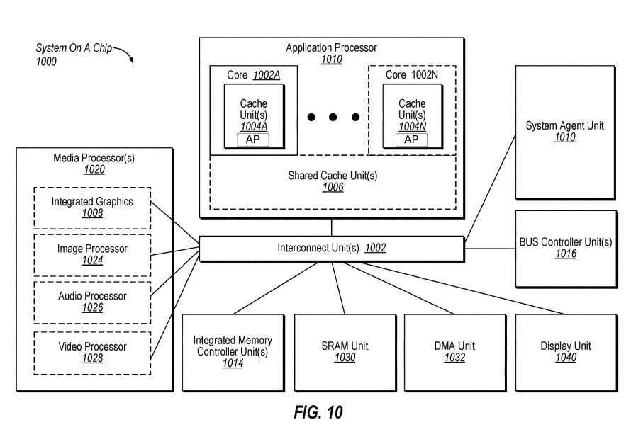

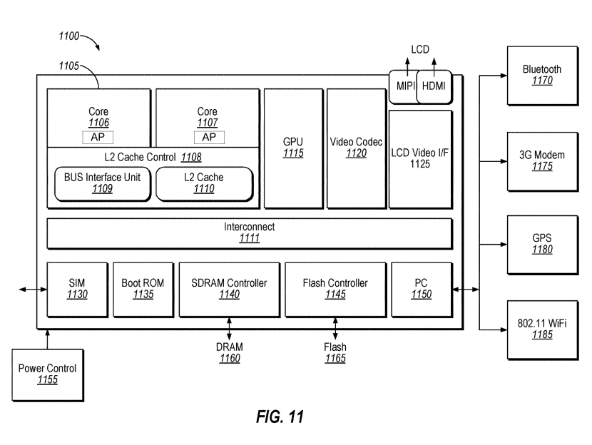

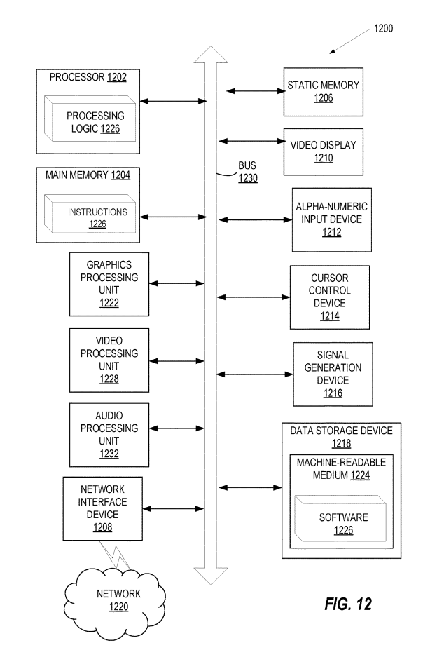