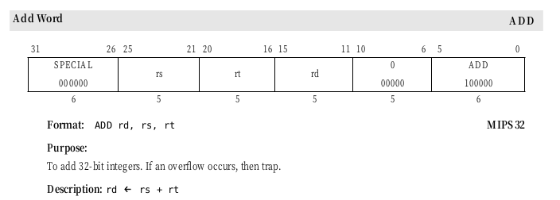

### 如何添加一条ir2（mips）

- 在ir2.h IR2_OPCODE中添加该指令
- 在ir2.c ir2_name() g_ir2_names中添加该指令的名字，该函数最后的assert可能需要更改
     -  在ir2_assemble.c的gm_format_table中添加该指令的编码信息，也就是添加GM_MIPS_OPCODE_FORMAT
     找到该指令的编码格式，mode就是32bit的编码信息，未知位按0填入，如add就是0x00000020
     - 将各个操作数按格式填入GM_OPERAND_ATTRIBUTE，一般就是查找GM_OPERAND_TYPE找到对应的填入。需要注意操作数顺序。对于是SD_SRC还是SD_DST，暂时应该是没有影响。
     - 如果没有找到GM_OPERAND_TYPE，自己添加一条，并在gm_relation_table和set_operand_into_instruction相应位置添加
- 上述三条的位置应保持相对一致，否则会出错，可以都在每一个的最后添加。
- 在ir2.c中在相应的append_ir2_opndxxx添加相应的指令，注意要检查参数是否正常。
  - 如果没有相应的append_ir2_opndxxx,可以自己添加一个函数。
  - 如果是load/store,需要在ir2_is_load/store函数中添加该指令的信息
- 第一次遇到四操作数指令时
     - 需要将ir2_to_string的循环中3改为4，否则信息不完整。
     - 需要在ir2_build中将第四个操作数设置为ir2_opnd_new_none，否则当访问第四操作数时可能会引发错误。
     - 需要将ra_alloc.c 中ra_temp_register_allocation的循环中将3改为4，否则如果第四个操作数是寄存器，则不会物理寄存器

